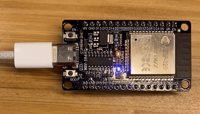

# Blinky-RS

A simple LED blinking project for ESP32 microcontrollers written in Rust using the `esp-hal` crate.  


## Features

- **Rust-based ESP32 development** using the `esp-hal` framework
- **Cross-platform build scripts** for Linux, macOS, and Windows
- **Optimized build profiles** for embedded development
- **Easy setup** with automated installation scripts

## Prerequisites

### Required Tools

- **Rust** (1.86 or later)
- **Build Tools**:
  - **Linux (Ubuntu/Debian, Fedora, openSUSE)**: See [espup requirements](https://github.com/esp-rs/espup?tab=readme-ov-file#requirements) for package installation
  - **macOS**: Xcode Command Line Tools (`xcode-select --install`)
  - **Windows**: [Microsoft Visual C++ Build Tools](https://visualstudio.microsoft.com/downloads/?q=build+tools#microsoft-visual-c-redistributable-for-visual-studio-2022)

### Hardware

- ESP32 development board
- USB cable for flashing
- Built-in LED

## Installation

### Automated Setup

Run the installation script to set up the entire ESP32 Rust toolchain:

```bash
# Make the script executable
chmod +x scripts/install.sh

# Run the installation
./scripts/install.sh
```

This script will:
- Install `espup` (ESP32 Rust toolchain manager)
- Install `espflash` (flashing and monitoring tool)
- Set up the ESP32 target compilation environment

## Building and Flashing

### Quick Start

Use the cross-platform flash script:

```bash
# Make the script executable
chmod +x scripts/flash.sh

# Flash to ESP32
./scripts/flash.sh
```

## Configuration

### ESP32 Variant Support

The project is currently configured for **ESP32** (original). To support other variants, see the [esp-hal supported chips](https://github.com/esp-rs/esp-hal?tab=readme-ov-file#esp-hal) for a complete list.

To configure for a different chip:

1. Update `Cargo.toml` dependencies:

```toml
[dependencies]
esp-bootloader-esp-idf = { version = "0.2.0", features = ["esp32s3"] } # For ESP32-S3
esp-hal = { version = "=1.0.0-rc.0", features = ["esp32s3", "unstable"] }
```

2. Update the installation script target:

In `scripts/install.sh`, change the target:

```bash
# For ESP32-S3
espup install --targets esp32s3
```

### Build Profiles

The project includes optimized build profiles:

- **Development**: Fast compilation with size optimization (`opt-level = "s"`)
- **Release**: Maximum optimization with LTO enabled

